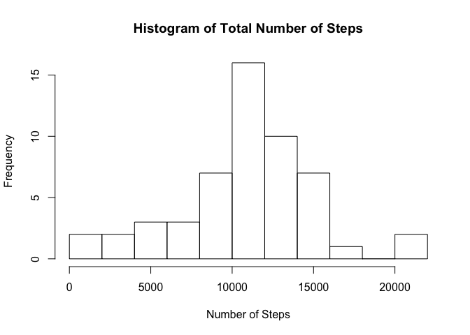
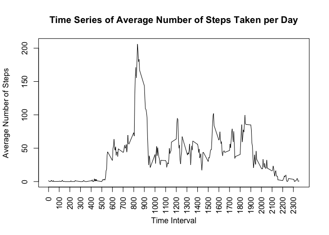
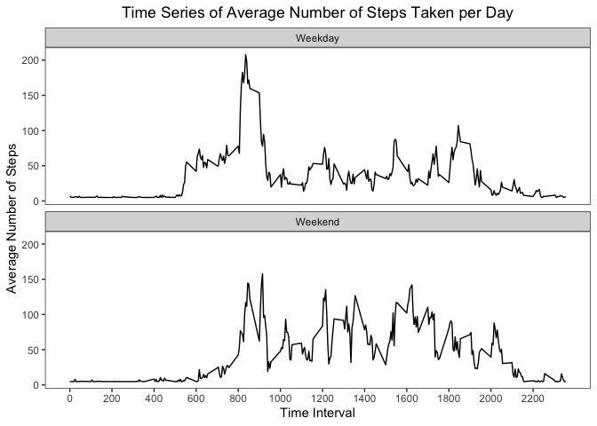

# Part 1
## Loading and preprocessing the data
Data is read into the environment, then using dplyr, the date column is 
converted to a date type while the interval and steps columns are 
converted to intergers.

```r
library(dplyr, warn.conflicts = FALSE)

# Load data
activity <- read.csv("activity.csv", stringsAsFactors = FALSE)

# Convert columns to proper formats
activity <- activity %>%
        mutate(date = as.Date(date)) %>%
        mutate_if(is.integer, as.numeric)
```

# Part 2
## What is mean total number of steps taken per day?
First the data is grouped by date and the number of steps per day totaled.

```r
library(dplyr)

# Group by date and get total for each date
stats1 <- activity %>%
        group_by(date) %>%
        summarize(Total.Steps = sum(steps))
```

Below is a histogram representing the frequency of total number of steps.

```r
# Plot frequency of number of steps in histogram                  
hist(stats1$Total.Steps, breaks = 15,
     main = ("Histogram of Total Number of Steps"), 
     xlab = ("Number of Steps"))
```

<!-- -->

The mean and median steps per day (excluding zeros and NAs) are reported below.

```r
# Print mean and median number of steps per day
summary1 <- summary(stats1$Total.Steps)
floor(summary1[4:3])
```

```
##   Mean Median 
##  10766  10765
```

# Part 3
## What is the average daily activity pattern?
For this section, the data is grouped by interval, then the average number of 
steps per interval is taken.

```r
library(dplyr)

# Group by interval and get average number of steps per interval
stats2 <- activity %>%
        group_by(interval) %>%
        summarize(Average.Steps = mean(steps, na.rm = TRUE))
```

The average number of steps taken per day is plotted below by time interval.

```r
# Plot average number of steps per interval
with(stats2, plot(interval, Average.Steps, type = "l", xaxt = "n",
                  main = "Time Series of Average Number of Steps Taken per Day",
                  xlab = "Time Interval",
                  ylab = "Average Number of Steps"))
axis(1, at = seq(0, 2355, 100), labels = seq(0, 2355, 100), las =2)
```

<!-- -->

The time interval with the highest average number of steps is reported below.

```r
# Report interval with the highest average number of steps
floor(as.data.frame((stats2[which.max(stats2$Average.Steps), ])))
```

```
##   interval Average.Steps
## 1      835           206
```

# Part 4
## Imputing missing values
The total number of missing values is reported below.

```r
# Report total number of missing values
TotNA <- sum(is.na(activity$steps))
TotNA
```

```
## [1] 2304
```

Missing values were found to only correspond to entire days of missing data, so
the missing value for each time interval was replaced by the average value for 
that interval across all days.

```r
library(dplyr)

# Replace NAs with average number of steps for that time interval
Activity.Complete <- activity %>% 
        mutate(steps = ifelse(is.na(steps), mean(steps,na.rm = TRUE), steps))
```

The new data set with imputed values was then grouped by date and a new histogram
was plotted, simillar to Part 2.

```r
library(dplyr)

# Group by date and get total number of steps including imputed data
stats3 <- Activity.Complete %>%
        group_by(date) %>%
        summarize(Total.Steps = sum(steps))

# Plot frequency of number of steps in histogram  
hist(stats3$Total.Steps, breaks = 15,
     main = ("Histogram of Total Number of Steps"), 
     xlab = ("Number of Steps"))
```

<!-- -->

The mean and median steps per day are again calculated excluding zeros, but now
with the imputed values replacing NAs.  It can be seen that the median value rose
very slightly.

```r
# Print mean and median number of steps per day
summary3 <- summary(stats3$Total.Steps)
floor(summary3[4:3])
```

```
##   Mean Median 
##  10766  10766
```

# Part 5
## Are there differences in activity patterns between weekdays and weekends?
Finally, the data was factored by weekday and weekend, then plotted to compare
the average activity pattern during the week vs over the weekend.

```r
library(dplyr)
library(ggplot2)

# Create weekday/weekend factor
weekdays1 <- c('Monday', 'Tuesday', 'Wednesday', 'Thursday', 'Friday')
Activity.Complete$wDay <- c('Weekend', 'Weekday')[(weekdays(Activity.Complete$date) %in% weekdays1)+1L]

# Group by interval and get average number of steps per interval
stats4 <- Activity.Complete %>%
        group_by(wDay, interval) %>%
        summarize(Average.Steps = mean(steps, na.rm = TRUE))

# Plot average number of steps per interval, split by weekday vs weekend
g <- ggplot(stats4, aes(x = interval, y = Average.Steps))
plot4 <- g + geom_line() +
        facet_wrap(wDay ~., nrow = 2) +
        ggtitle("Time Series of Average Number of Steps Taken per Day") +
        xlab("Time Interval") +
        ylab("Average Number of Steps") +
        scale_x_continuous(breaks = seq(0, 2355, 200)) +
        theme_bw() +
        theme(panel.grid.major = element_blank(),
              panel.grid.minor = element_blank(),
              plot.title = element_text(hjust = 0.5)) 
print(plot4)
```

<!-- -->

From this plot, it can be concluded that the subject, in general, began taking 
steps later in the day during the weekend, and continued to take steps until 
later in the evening. The subject also appears to take more spread throughout the
day on the weekend, but has a higher peak amount of steps per interval during the
week.

